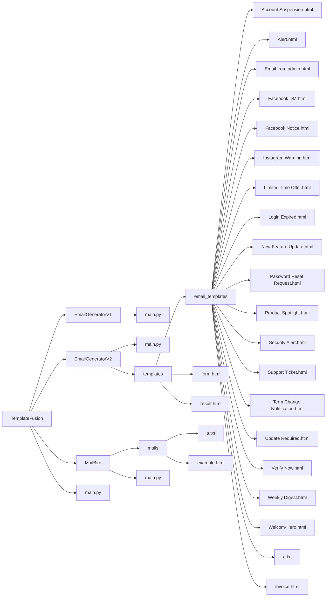

# TemplateFusion

> **Actively maintained by [zerosocialcode](https://github.com/zerosocialcode)**

TemplateFusion is a professional, modular platform for streamlined creation, management, and delivery of HTML email templates. Designed for flexibility and ease of use, TemplateFusion features intuitive web-based generators, a robust template library, and an integrated email sending utility.

---

## Preview


---

## Features

- **Modular Architecture:**  
  Select from specialized modules for email template generation and delivery.

- **Web-Based Template Generators:**  
  Create custom HTML email templates with interactive, code-free forms.

- **Extensive Template Library:**  
  Utilize a variety of pre-built templates for scenarios such as security alerts, password resets, marketing updates, and more.

- **Integrated Email Sending (MailBird):**  
  Send emails directly from the command line using the MailBird module.

- **Unified Main Controller:**  
  Manage all modules with a single entry point (`main.py`) for a seamless workflow.

- **Actively Maintained:**  
  Receive regular updates and support from [zerosocialcode](https://github.com/zerosocialcode).

---




---

## Getting Started

### 1. Install Requirements

Before using TemplateFusion, ensure you have all dependencies installed.  
Run the following command in your project directory:

```bash
pip install -r requirements.txt
```

> The project requires Python 3.7 or higher and Flask for web-based generators.

---

### 2. Configure MailBird for Sending Emails

To use the MailBird module for sending emails, you must first configure your sender email account:

1. **Open `MailBird/main.py` in a text editor.**
2. **Add your Gmail address and an app password** (not your regular Gmail password) as instructed in the script.  
   - **App passwords** are special 16-character codes generated by Google for connecting third-party applications securely.

#### How to Get a Gmail App Password

1. Go to your [Google Account Security page](https://myaccount.google.com/security).
2. Enable **2-Step Verification** if you haven't already.
3. After enabling 2-Step Verification, go to the **App passwords** section.
4. Select "Mail" as the app and "Other" or your device as the device, then click "Generate".
5. Copy the 16-character app password shown and paste it into the appropriate field in `MailBird/main.py`.

> **Never use your regular Gmail password in third-party scripts. Always use an app password for enhanced security.**

---

### 3. Launch the Main Controller

From the root directory, start the main controller script:

```bash
python main.py
```

---

### 4. Select a Module

- The main controller will automatically detect and list all available modules, such as EmailGeneratorV1, EmailGeneratorV2, and MailBird.
- Follow the prompt to select which module you want to use.

---

### 5. Follow Module Instructions

- **Template Generators:**  
  You will be guided to a web interface to create your custom email template. Fill out the form and generate your template as needed.

- **MailBird:**  
  Select an email template from the `MailBird/mails/` directory and provide recipient details to send your email.

#### Example Email Sending Workflow

1. Start `main.py` and select EmailGeneratorV2.
2. Use the web interface to design and download your HTML email template.
3. Move the generated template to `MailBird/mails/`.
4. Open `MailBird/main.py`, set your Gmail and app password.
5. Restart `main.py`, select MailBird, and follow prompts to send your email.

---

## Customization

- **Add New Templates:**  
  Place HTML files in `EmailGeneratorV2/templates/email_templates/` to expand your template library.

- **Customize Forms:**  
  Edit `form.html` within the template generators to adjust input options.

- **Extend MailBird:**  
  Enhance or adapt `MailBird/main.py` to support additional sending features as needed.

---

## Contribution

Contributions, feature requests, and feedback are welcome! Please open an issue or submit a pull request.

---

## TemplateFusion Main Controller

The `main.py` script serves as the unified launcher and module manager for the TemplateFusion toolkit. It provides an interactive, terminal-based menu to discover, select, and run the various tools (such as email template generators and the MailBird email sender) included in the TemplateFusion suite.

### What is This Script?

The TemplateFusion main controller is designed to:

- **Scan** the project directory for available tool modules (e.g., EmailGeneratorV1, EmailGeneratorV2, MailBird).
- **Display** a visually appealing, colored menu with project branding and tool listings.
- **Allow users** to select which tool to run via a simple numbered prompt.
- **Launch** the selected tool in a subprocess, isolating its execution from the main menu.
- **Provide a smooth user experience** with screen clearing, banners, and graceful exits.

### How Does It Work?

1. **Startup & Scanning:**  
   When run, the script looks for subdirectories containing a `main.py` or `__main__.py` file, identifying them as modules/tools.

2. **Banner & Branding:**  
   The script loads a custom banner from `.banner.txt` if available, and displays project/developer info from `.dev.json` (or defaults).

3. **Interactive Menu:**  
   All detected tools are listed with numbers. The user selects a tool to run by entering its corresponding number.

4. **Module Execution:**  
   The chosen tool is launched in its own process, with its working directory set appropriately. After the tool exits, the user can return to the menu.

5. **Graceful Exit:**  
   Exiting the menu or pressing Ctrl+C will clear the screen and display a goodbye message.

### Usage Instructions

#### 1. Requirements

- Python 3.7 or higher
- `termcolor` package  
  Install with:  
  ```bash
  pip install termcolor
  ```
#### 3. Running the Controller

From the TemplateFusion project root, simply run:

```bash
python main.py
```

- The script will present a menu listing all available tool modules.
- Enter the number of the tool you want to run.
- When finished with a tool, press Enter to return to the menu and select another, or press Ctrl+C to exit.

### Customization & Open-Source Freedom

TemplateFusion is **fully open-source**. You are free to:

- **Change the project name, developer name, branding, and all configuration** for your own personal, organizational, or commercial use.
- Edit `.dev.json` to set your own `tool_name` and `developer`—these will be displayed in the menu and banner.
- Replace `.banner.txt` with your own ASCII art or branding.
- Add, remove, or rename modules and tools according to your needs.

There are **no restrictions**—you can adapt and redistribute this controller as you wish. This flexibility is provided to empower anyone to make TemplateFusion their own.

### For Personal Use

- **Single Entry Point:**  
  Use this script as your main access point for all TemplateFusion modules.
- **Easily Add/Remove Tools:**  
  Just add new subdirectories with a `main.py` file to expand your toolkit; the controller will auto-detect them.
- **Consistent Experience:**  
  Benefit from a unified, branded, and user-friendly interface every time you use or share TemplateFusion.

### Notes

- Tools are run in new processes; any errors or keyboard interrupts are handled gracefully.
- The controller handles Windows and Unix systems for screen clearing and sizing.

---

## License

[MIT License](LICENSE)  
© 2025 [zerosocialcode](https://github.com/zerosocialcode)
